
# Data Mining and Machine Learning Group Coursework: CrashProphet
## Group: Pink Twins

## Group Members:

1. BELPAIRE Baudoin - @BaudFrag        - H00445613
2. LARDEAU Valentin - @ValentinLardeau - H00453864
3. PERROT Romain    - @RP-08           - H00448974
4. SANTE Guilhem    - @guilhem-sante   - H00447741
5. WALDVOGEL Elliot - @elliotwld       - H00447733

## Topic of the Project: 

### Single Sentence Title:
&emsp; Image-Based Accident Severity Prediction for Safer Navigation in the UK: Enhancing Generative Routing Application such as Google Map or Waze using AI.

### Context: 
&emsp; This project aims to offer a new option for generating a car itinerary for a car GPS application. When people choose their itinerary, they can decide to opt for the shortest route, the fastest or any of the displayed option. With our solution, we can allow them to pick the safest one. Thanks to this project, we hope that the number of car accident will tend to decrease, or at least their severity.

### Problems: 

* Given the huge number of roads in the UK, which part should we be focusing on?
* The severity of an accident depends on many different parameters, which ones are we selecting?
* Is it possible to determine the potential severity of an accident from the start to the end of an itinerary?

### Hypothesis: 

* We need to focus on the parts of roads that already had accidents to find a pattern.
* In our context, we can access easily parameters such as the date, time, weather and state of the road (because the application already has them). So, we will prioritize these one and the satellite images of the road.
* This project will only focus on predicting the severity at a specific location. In other words, we are focusing on the success of the project at a specific location, which is the first step of creating a safer itinerary.

### Ethical considerations: 

&emsp; If this project is ever implemented and used, one of the most ethical considerations we need to take into account is the transparency of the model. Indeed, users need to know how the model make its decisions in order to trust it. In addition, we also need to ensure that the biases of the data are updated to be as close as possible to reality. Therefore, particular attention must be paid to additional data in order to prevent accuracy from decreasing. Finally, we need to keep the data anonymous to ensure that the user's privacy is protected.

## The Datasets: 

### Generalities: 
&emsp; To complete this project, we needed a dataset with a large amount of data, but also one that accurately described the severity of the accident. That is why we chose this dataset from the Kaggle website:
 * Road Accident Dataset UK 2005 - 2014: https://www.kaggle.com/datasets/devansodariya/road-accident-united-kingdom-uk-dataset/
 * Download link: https://www.kaggle.com/datasets/devansodariya/road-accident-united-kingdom-uk-dataset/download?datasetVersionNumber=1
    
&emsp; This dataset is under the license: 'CC0: Public Domain'. This is a permissive public domain dedication that waives all copyright and related rights that the creator may have had in the dataset, essentially placing the dataset in the public domain. In other words, it is free to use and free of charges. Besides, it fully covers all the requirements we had for implementing our project. This is why we only used this one.

&emsp; In addition, we also needed a dataset with satellite images to determine the severity of the car accident related to the road itself. However, there was no suitable datasets online. So, we created our own. Using a Google API, we were able to download a satellite view of the road depicted in the dataset.

### Examples: 

&emsp; In order to better understand our dataset, here are two specific examples from two of its rows: 

|                    Rank                     |             Row 1              |                    Row 2                    |
|---------------------------------------------|-------------------------------:|--------------------------------------------:|
| Accident Index                              | 200501BS00001                  | 200501BS00002                               |
| Location Easting OSGR                       | 525680                         | 524170                                      |
| Location Northing OSGR                      | 178240                         | 181650                                      |
| Longitude                                   | -0.19117                       | -0.211708                                   |
| Latitude                                    | 51.489096                      | 51.520075                                   |
| Police Force                                | 1                              | 1                                           |
| Accident Severity                           | 2                              | 3                                           |
| Number of Vehicles                          | 1                              | 2                                           |
| Number of Casualties                        | 1                              | 2                                           |
| Date                                        | 04/01/2005                     | 05/01/2005                                  |
| Day of Week                                 | 3                              | 4                                           |
| Time                                        | 17:42                          | 17:36                                       |
| Local Authority District                    | 12                             | 12                                          |
| Local Authority Highway                     | E09000020                      | E09000020                                   |
| 1st Road Class                              | 3                              | 4                                           |
| 1st Road Number                             | 3218                           | 450                                         |
| Road Type                                   | Single carriageway             | Dual carriageway                            |
| Speed Limit                                 | 30                             | 30                                          |
| Junction Control                            | None                           | Automatic traffic signal                    |
| 2nd Road Class                              | -1                             | 5                                           |
| 2nd Road Number                             | 0                              | 0                                           |
| Pedestrian Crossing Human Control           | None within 50 metres          | None within 50 metres                       |
| Pedestrian Crossing Physical Facilities     | Zebra crossing                 | Pedestrian phase at traffic signal junction |
| Light Condition                             | Daylight: Street light present | Darkness: Street lights present and lit     |
| Weather Condition                           | Raining without high winds     | Fine without high winds                     |
| Road Surface Condition                      | Wet/Damp                       | Dry                                         |
| Special Condition at Site                   | None                           | None                                        |
| Carriageway Hazards                         | None                           | None                                        |
| Urban or Rural                              | 1                              | 1                                           |
| Did Police Officer Attend Scene of Accident | Yes                            | Yes                                         |
| LSQA of Accident Location                   | E01002849                      | E01002909                                   |
| Year                                        | 2005                           | 2005                                        |

### Visualisation: 

&emsp; We only have a visualisation for the Kaggle dataset, as it only matters for this one. The second dataset only has three hundred images of each type of road.  
Firstly, we made a small visualisation of the data on a map of the United Kingdom to get a representation of the accident:

Secondly, we made a visualisation of the whole dataset to fully understand what we were going to manipulate: 

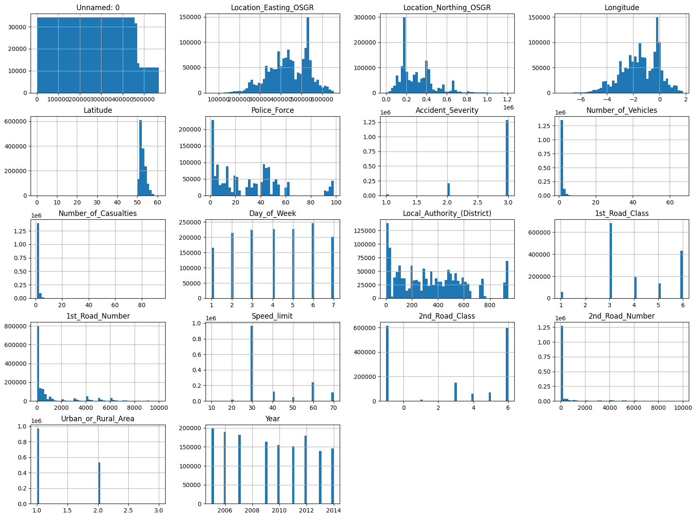

&emsp; This visualisation is made on the raw dataset. We can already see that some information will not be relevant for the next step of the project such as the unnamed attribute. Another important thing to note is the distribution of the 'Accident_Severity' attribute. We can see that our classes are very unbalanced.  
&emsp; We have also calculated the correlation of every feature of the dataset: [correlation](https://github.com/dmml-heriot-watt/group-coursework-pink-twins/blob/main/notebooks/traitement/correlation.py). This allowed us to better understand the relationship between our features and to know which ones we could erased.

Based on these analyses, we knew which features we had to get rid of and what we had to watch out for.

### Conclusion on the Dataset: 

&emsp; Thanks to the previous section, we knew which features to drop. We also had the first difficulties linked with the qualitative values. Our dataset had some columns with text as value. So, we tried to sort them out and to convert them to quantitative values. Finally, we also highlighted the fact that we have way more category 3 of 'Accident_Severity' than the other two.  
&emsp; Knowing these informations about our data allowed us to processed them intelligently.

### Pre-processing: 

* Getting rid of useless features for our project such as the accident index
* Converting qualitative values to quantitative values
* Removing all 'Not a Number' (NaN) values to have useful data
* Keeping only the month in the Date feature, as we already have a year and day column
* Transforming the Time feature into a discrete attribute by removing the minutes to categorize it
* Exporting the processed dataset into AWS to save time when using it

Link of the notebook: [Preprocessing](https://github.com/dmml-heriot-watt/group-coursework-pink-twins/blob/main/notebooks/dataset_traitement.ipynb)

### Results of the split: 

The following table shows the number of rows before and after the pre-processing: 

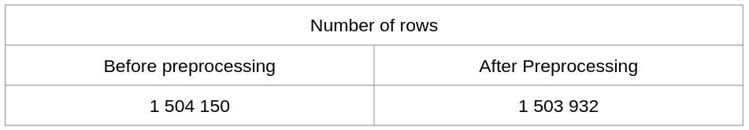

## Clustering: 

### Goal: 

&emsp; The aim of the clustering algorithm is to sort our data into clusters in order to find a target feature, which we already have. So, we will demonstrate in this part that this type of algorithm is not suitable for our project. As shown previously, we would expect to have three cluster, one per severity.  
We will now explain our clustering experiment on our data. For the three of them, we used the same input features:  
* day in number (e.g., 1 for Monday)
* time (only the hour)
* road type (qualitative value mapped to the quantitative value)
* speed limit (number)
* weather (qualitative value mapped to the quantitative value)
* road surface condition (qualitative value mapped to the quantitative value)
* urban or rural (1 for rural, 2 for urban)
* year (number)
* month(number)

### Algorithm: 

To demonstrate the fact that clustering is not useful to us, we used three algorithms: 

#### &emsp; K-mean algorithm: 

&emsp; The first algorithm we tried was the K-mean algorithm. In order to visualise the results, we performed a PCA to reduce the data to two dimensions. Here are the results:

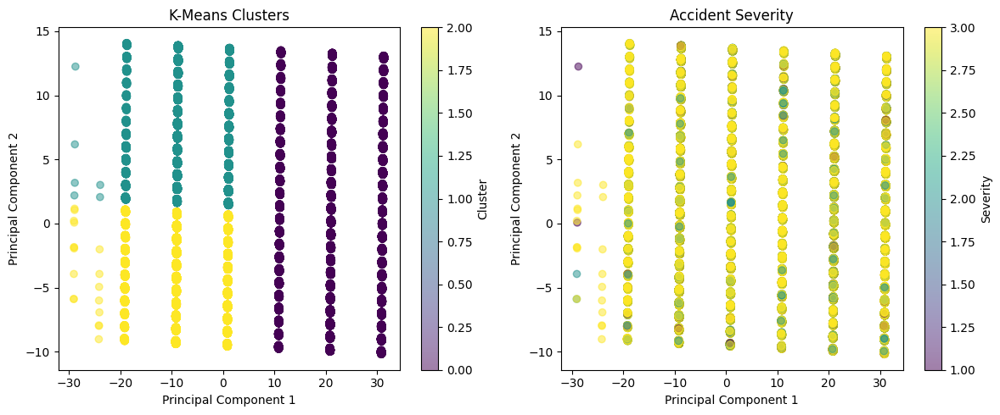

&emsp; This result highlights the fact that the algorithm is not suited for our data. Indeed, even if we have the right number of clusters, we can see that it takes data from each severity. This is why we did not keep this model. This lack of results can be explained by the data itself. We did a lot of experiment changing the hyperparameters, but this is the "best" result we obtained.

Link to the notebook: [K-mean](https://github.com/dmml-heriot-watt/group-coursework-pink-twins/blob/main/notebooks/k_means.ipynb)

#### &emsp; Hierarchical Clustering: 

&emsp; The second algorithm was the hierarchical clustering. To visualise it, we made a dendrogram. Here are the results:

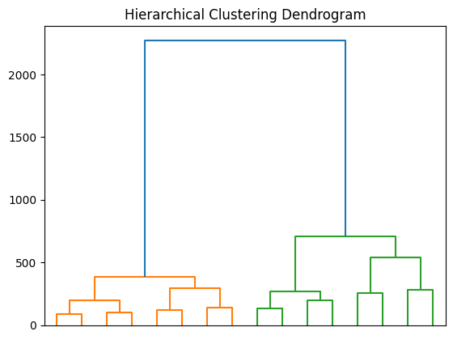

&emsp; This dendrogram highlights the fact that clustering is not adapted to our data. Indeed, we only have two different classes whereas three were expected. Even by changing the hyperparameters, we were never able to obtain three.

Link to the notebook: [Hierarchical clustering](https://github.com/dmml-heriot-watt/group-coursework-pink-twins/blob/main/notebooks/hierarchical_clustering.ipynb)

#### &emsp; Affinity Clustering: 

The third algorithm we tried was the affinity clustering. To visualize the results, here is an image: 

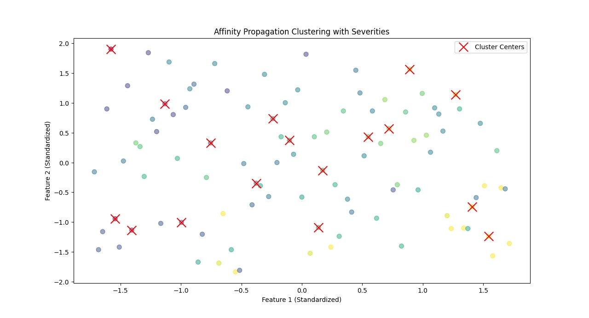

&emsp; This image highlights the fact that this clustering is also not suitable for our data. We wanted to find 3 clusters, but as we can see, there are more than three. Besides, we cannot see a true scatter plot. Our data is simply scattered and does not create true clusters. This is certainly because our data are too complex for this type of algorithm.

Link to the notebook: [Affinity Clustering](https://github.com/dmml-heriot-watt/group-coursework-pink-twins/blob/main/notebooks/affinity_clustering_old.ipynb)

### Conclusion: 

&emsp; Without any surprises, we can conclude that clustering is not useful in our project. We can draw this conclusion because the different methods all gave poor results.  
&emsp; Nevertheless, this is not really an issue for us because we already have our target feature, which is 'Accident_Severity'. This way, we can continue the project without any difficulties.

## Models: 

&emsp; Once the data had been analysed and pre-processed, we were able to run supervised models. We decided to try two different models and selected the best one.

#### &emsp; Decision Tree:

&emsp; The first model we tried is the decision tree. In order to train it, we used the following features:  
* day in number (e.g., 1 for Monday)
* time (only the hour)
* road type (qualitative value mapped to the quantitative value)
* speed limit (number)
* weather (qualitative value mapped to the quantitative value)
* road surface condition (qualitative value mapped to the quantitative value)
* urban or rural (1 for rural, 2 for urban)
* year (number)
* month(number)

&emsp; As this is a supervised model, we also need a target feature, which is still: Accident_Severity.

&emsp; We made multiple experiments to make sure we had the best possible model. For example, we worked on the number of tree generated to understand the impact of this parameter on the model. We also tried out other parameters such as the number of features or the number of leaves. By doing all these experiments, we conclude that the model we currently have is the best one for our data. Thanks to this, we have achieved 95% accuracy. The actual results can be found in the following confusion matrix:

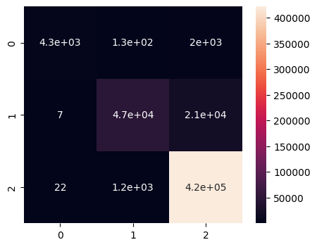

&emsp; Using this heat map, we can see that all three classes are predicted quite accurately by the models despite the imbalance problem. Therefore, this model seems to be more than acceptable. You will find all the important metrics in the following table:

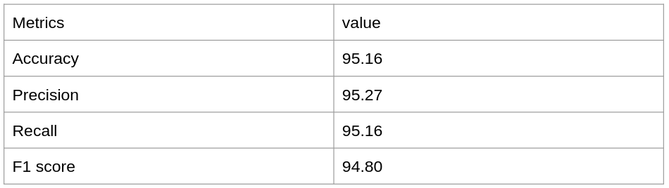

Link to the notebook: [random forest](https://github.com/dmml-heriot-watt/group-coursework-pink-twins/blob/main/notebooks/random_forest.ipynb)

#### &emsp; Bayesian Model: 

&emsp; The second final model we tried was the Bayesian model. We decided to run another supervised model in order to compare the results and decide which model to use. To train this model, we used the same features as the random forest:  
* day in number (e.g., 1 for Monday)
* time (only the hour)
* road type (quantitative value mapped to the qualitative value)
* speed limit (number)
* weather (quantitative value mapped to the qualitative value)
* road surface condition (quantitative value mapped to the qualitative value)
* urban or rural (1 for rural, 2 for urban)
* year (number)
* month(number)

&emsp; We kept 'Accident_Severity' as the target feature. We obtained an accuracy of 85% and the following confusion matrix:  

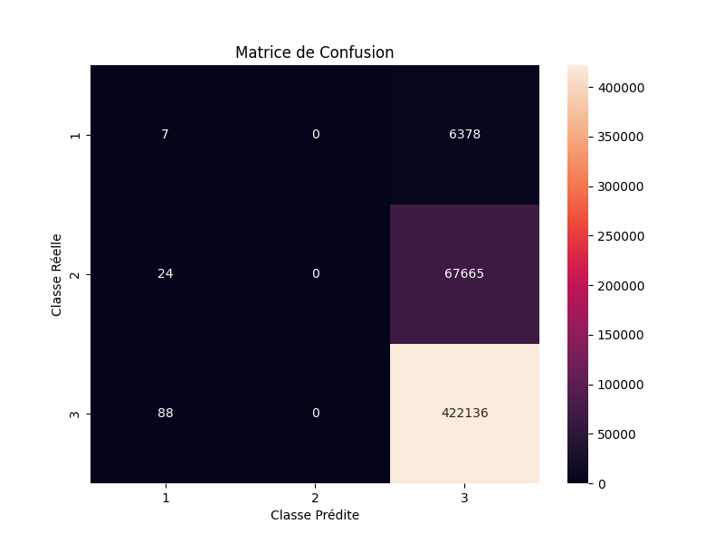

&emsp; We can notice that, despite the high accuracy, only the third class is predicted. This issue comes from the unbalanced data. We have tried various methods to solve this problem:  
* Artificially balance the classes by only selecting the same number of rows as the smallest class. This method allowed us to predict all three classes, but the model only achieved 44% accuracy because it did not have enough data to train on.
* Artificially balancing the classes by duplicating the rows of the first class and reducing the third one to have the same amount as the second class. Despite this new dataset, the results were just as bad as the previous try.
* Artificially balance the classes by duplicating the rows of the first class to have the same amount as the second class but without reducing the third one. This new experiment produced the same results as the first trial. Again, we find ourselves with an unbalanced situation where only the third class is predicted.
* Pre-train the model only on the first class to avoid starting with a random weight. This last method made no difference because the number of rows belonging to the third class were too important for it to matter.

With our "best" model, we obtained the following table:

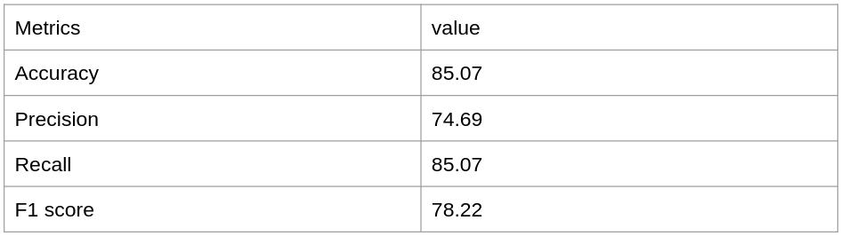

&emsp; Therefore, despite all our experiments, we were unable to make this model accurate. So, we concluded that it was not a suitable model for our data.

Link to the notebook: [Bayesian model](https://github.com/dmml-heriot-watt/group-coursework-pink-twins/blob/main/notebooks/bayes.ipynb)

#### Conclusion: 

&emsp; Unsurprisingly, we decided to select the random forest model for the next steps of our project. To avoid having to calculate the model every time, we saved it on AWS.

## CNN: 

&emsp; The purpose of the CNN in our project is to analyse a satellite image of a road and determine the type of road. This is an information that we really need for our project, but we have no other option than to use a CNN to get it. To train it, we used the dataset we generated ourselves, made of three hundred images for each type. When we receive the image from the API, they have a size of 400x400 but we resize them for the CNN to 224x224. So, our training inputs are three hundred 224x224 images of the classes:  
* Dual carriageway
* One way street
* Roundabout
* Single carriageway
* Slip road

&emsp; Once the model has been trained, the input will be a 224x224 satellite image of a road and the output will be one of the classes in the list above.

#### Architecture: 

&emsp; Our CNN is based on the VGG16 model. We decided to use this model and add a few layers.  
The architecture of the VGG16 is as follows:

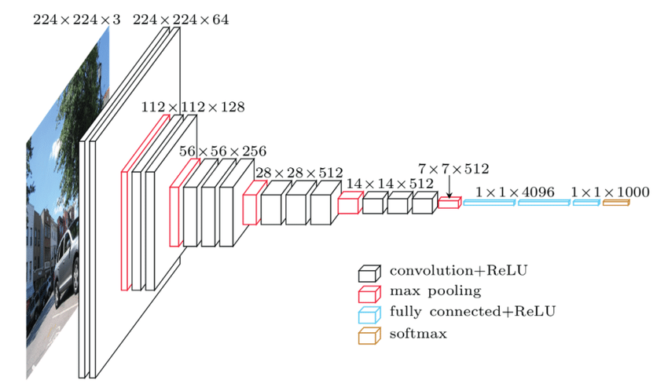
Source: ResearchGate

We added to this these following layers: 
* A flatten layer
* A dense layer with the relu activation function and an output of 512
* A dropout layer with a 0.2 parameter
* A dense layer with the softmax activation function and an output of the number of classes: 5

&emsp; We added these layers because we needed a solution to prevent our model to overfit, which was not the case with the VGG model.

#### Results: 

Using this model, we were able to obtain this confusion matrix: 

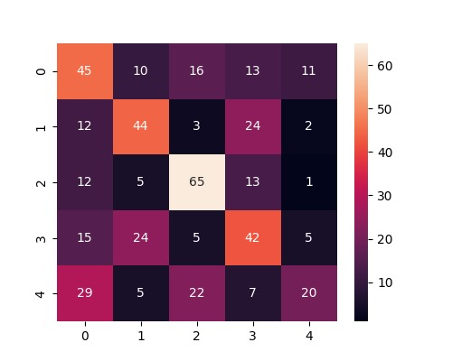

&emsp; Thanks to this matrix, we can see that our model can predict all the classes and achieve an accuracy of almost 50%. Even though this accuracy is not very high, we have tried other combinations, but it was the highest we have ever had. Nevertheless, that is not really an issue because this project is currently a proof of concept, so it is satisfying enough.

We were also able to obtain this table:

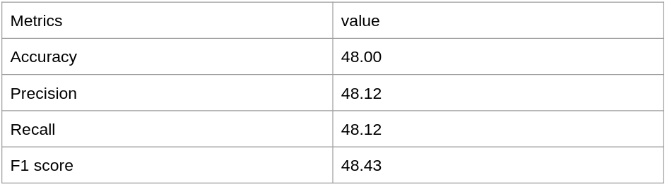

Link to the notebook: [CNN](https://github.com/dmml-heriot-watt/group-coursework-pink-twins/blob/main/notebooks/cnn.ipynb)

#### Conclusion:

&emsp; In conclusion, the CNN model is indispensable to our project because thanks to it we are able to predict the severity of a possible accident on a random road. It can therefore be considered as the foundations of CrashProphet. Furthermore, as we have generated the database for this part, we are certain that the data are suitable for our model. Nevertheless, we need to keep in mind that a good way of improving our model would be to have more than three hundred pictures per class. However, in the context the project, this is already more than enough.

## Conclusion: 

&emsp; In conclusion, we can say that the different models tested allowed us to be very selective in our results and to achieve results that we might not otherwise have obtained. It also helped us to cover all the aspects we needed to work on.  
&emsp; On the top of it, we were lucky enough to find a dataset with feature covering all the aspects we needed. The only aspect of the dataset that was a little inconvenient was the class imbalance. So, if we wanted to deploy it, we would certainly search for the lacking data, especially for the accident severity class 1.  
&emsp; Speaking of deployment, we would also need to get better results in our CNN model and test whether we could find a better performing model than the random forest.  
&emsp; Finally, we need up-to-date, certified data as there will always be car accidents. This will raise another issue: having the computing power to calculate and process all the data. It would also raise the ethical aspect that we mentioned before.  
&emsp; In order to solve some of these problems, it would be really important to have verified data and total transparency for decision-making.

---

## Collapsed Section: 

### User Interface: 
We thought it would be relevant to add some information about the code itself. We decided to implement a very basic user interface. Using the Tkinter library, we created a window that open when the code is launched. In this window, you can enter all the parameter manually. These parameters are the one that, in our context, the applications should have access to. For instance, when someone asks for an itinerary, the application knows the date, the weather... You also need to select an image to test (you can find them [here](https://github.com/dmml-heriot-watt/group-coursework-pink-twins/tree/main/data/img/test_images)) by clicking on the button. The prediction will then be printed at the bottom of this window. Here is a screenshot of what it looks like: 

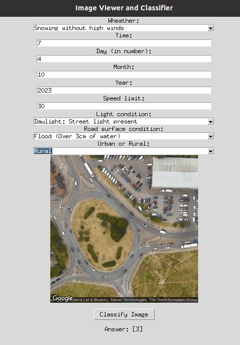

Link to the script: [user interface](https://github.com/dmml-heriot-watt/group-coursework-pink-twins/blob/main/scripts/ui_crash_prophet.py)

### Architecture of the Project: 

We have drawn up a diagram to explain how the satellite images dataset has been created : 

