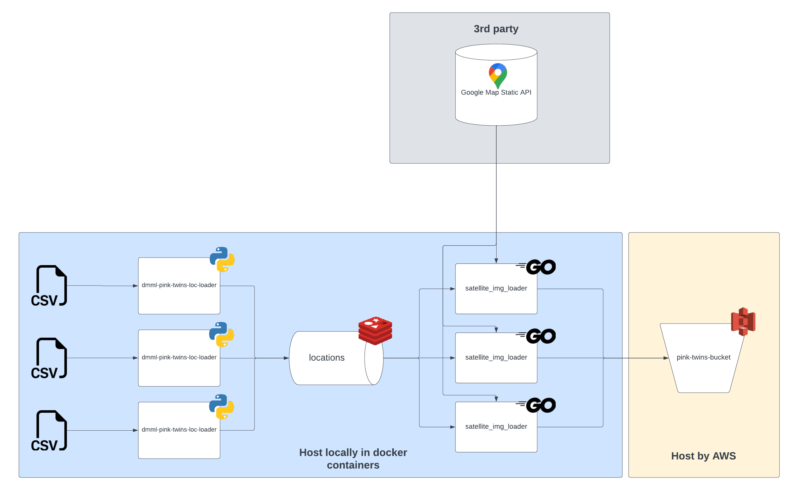

# redis_to_gmaps_s3

## Overview
The following Go program have been made in the purpose of consumming a Redis queue of coordinates, to download their related satellite image from the Google Static Map API and store them in a defined S3 Bucket.



### Getting Started

### Run with Docker

#### Requirements
To run this script you'll need the following:
- [docker](https://www.docker.com/get-started/)
- [docker compose](https://docs.docker.com/compose/install/)
- a Redis queue already running filled with locations (see the [csv_to_redis_queue](../scripts/redis_to_gmaps_s3/README.md))
- an access key id and secret for a S3 Bucket
- an [API key for the Google static Map API](https://developers.google.com/maps/documentation/javascript/get-api-key#create-api-keys).

#### Step by Step
1. Define a configuration in a file named `redis_to_gmaps_s3.yml` at the working dir root following the configuration template in `./default.yml`.

2. Setup the containers with docker compose with the following command line:

```sh
docker compose up
```

3. Wait up for this log to signals the program has finished:

```sh
redis_to_gmaps_s3-1 no more element in Redis queue, work done
```

Then check up the S3 Bucket all the images should have been pushed to to the defined folder.

### How can I access the S3 bucket data ?

To access the data of the S3 bucket you will need the appropriate
**access key id** and **access key secret**, those should have been kept by the
creator of the S3 bucket (and that's likely to be me => @guilhem-sante).

You should then access the S3 bucket content through a CLI (like
[aws](https://aws.amazon.com/cli/)), or from a dedicated GUI like
[expandrive](https://www.expandrive.com/desktop/) (I personnaly recommand the
usage of a GUI).

### How can I setup a S3 Bucket ?
you'll find a terraform configuration in the `./terraform` folder to easily setup a new S3 Bucket and associated users on AWS.

#### How can I run Terraform ?

##### Requirements
To run Terraform you'll need:
- [terraform CLI](https://developer.hashicorp.com/terraform/tutorials/aws-get-started/install-cli)
- credentials for an AWS account with admin permissions

#### Step by Step

1. In the `./terraform` directory initialize terraform:

```sh
terraform init
```

2. Then apply the configuration with the following command line:

```sh
terraform apply
```

The environment name doesn't matter.
After apply you can retrieve the new users credentials in the .tfstate file in the `output` object.

From those credentials you should be able to push objects to the newly created S3 Bucket.

### Configuration

You can configure the script with the following environment variables:

| NAME | DESCRIPTION | REQUIRED | DEFAULT VALUE |
| :---: | :---: | :---: | :---: |
| nb_worker | The number of goroutine that will run simultanely | no | 1 |
| log_level | The minimum log level | no | "INFO" |
| google_api.key | The required API key for any requests to the Google Static Map API | yes | |
| google_api.picture.zoom | The zoom scope (from 1 to 20) of the satellite picture | no | 18 |
| google_api.picture.width | The image width in pixel | no | 400 |
| google_api.picture.height | The image height in pixel | no | 400 |
| google_api.picture.map_type | The map type to download image from | no | "satellite" |
| google_api.picture.format | The image type format to download | no | "jpg" |
| redis.addr | The address of the Redis server | no | "localhost:6379" |
| redis.password | The password for the redis server if any | no | |
| redis.db | The database to get elements from | no | 0 |
| redis.queue_name | The queue name to get elements from | no | "locations" |
| s3.endpoint | The endpoint of the S3 bucket | no | "s3.amazonaws.com" |
| s3.region | The region of the S3 bucket if any | no | |
| s3.bucket_name | The S3 bucket name | no | "pink-twins-bucket" |
| s3.image_folder | The folder in which satellite images should be pushed | no | satellite-images |
| s3.access_key_id | The access key id to access the S3 Bucket | yes | |
| s3.access_key_secret | The access key secret to access the S3 Bucket | yes | |
